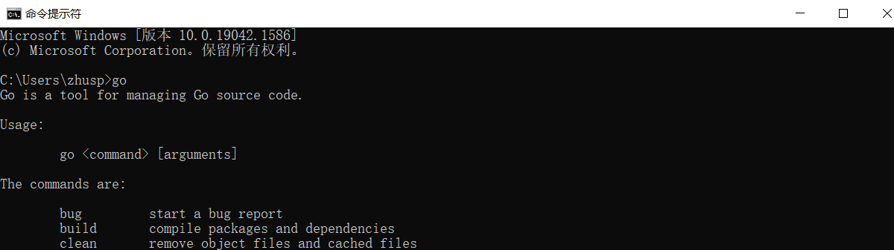

# golang笔记

​	用来记录golang的学习过程：

* 安装golang

## go的安装

​	因为头一次用，所以选择Windows安装。

* 到指定位置下载go的安装包

>安装包下载地址为：https://golang.org/dl/。
>
>如果打不开可以使用这个地址：https://golang.google.cn/dl/。

* 直接安装，一直点next到底，记住保存路径


* 设置环境变量
  * 添加环境变量：GOROOT，变量值：C:\Go\（安装目录）
  * 修改环境变量：Path，变量值：C:\Go\bin\（安装目录）

* 打开cmd，直接输入go



* 输入go-version，查看版本号，输出即可。

```cmd
C:\Users\zhusp>go version
go version go1.17.8 windows/amd64
```

* 解释一下安装目录

>- `/bin`：包含可执行文件，如：编译器，Go 工具
>- `/doc`：包含示例程序，代码工具，本地文档等
>- `/lib`：包含文档模版
>- `/misc`：包含与支持 Go 编辑器有关的配置文件以及 cgo 的示例
>- `/os_arch`：包含标准库的包的对象文件（`.a`）
>- `/src`：包含源代码构建脚本和标准库的包的完整源代码（Go 是一门开源语言）
>- `/src/cmd`：包含 Go 和 C 的编译器和命令行脚本

